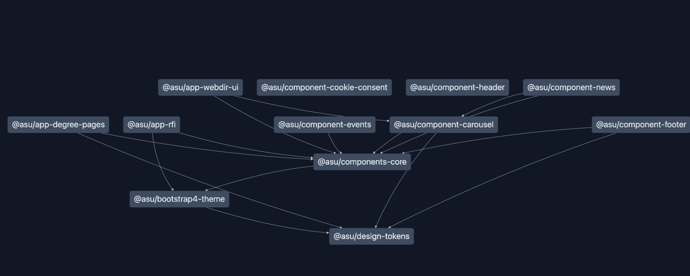
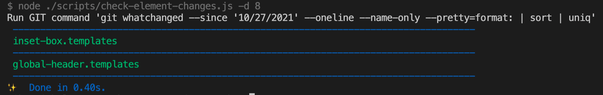
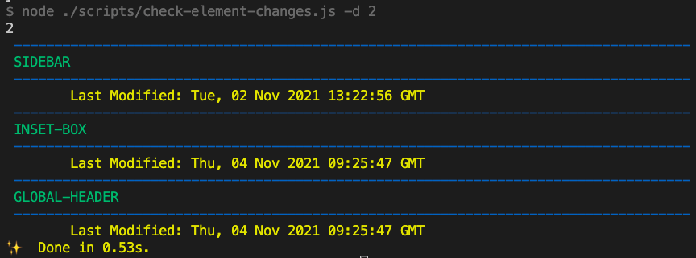

# ASU Unity Design System (UDS)
## ❯ Quickstart Guide

Bootstrap 4 UI theme and React components for building ASU Web Standards 2.0 compliant web sites and apps.

## ❯ How to use the private package registry:

The ASU Unity Design System packages are published to GitHub's package registry. This is not the same as the NPM registry. To use the packages, you need to belong to ASU's GitHub organization and to configure your local NPM to use this registry.

1. If you don't already have it [request access to the Unity Design System GitHub Repo](https://asu.edu/webservices).
2. Once you have access, there is a ```.npmrc.example``` file in the root of this project with the correct scope of the ```@asu``` packages. Make a copy and name it ```.npmrc``` and replace the ```YOUR_TOKEN_HERE``` with a [GitHub Personal Access Token](https://docs.github.com/en/packages/working-with-a-github-packages-registry/working-with-the-npm-registry#authenticating-to-github-packages) to have a project-based configuration for adding Unity package dependencies to your project. Alternately, some users may wish to include these configurations in the ```.npmrc``` in their HOME folder, or in another project's ```.npmrc``` instead.
3. The first line in the ```.npmrc``` tells NPM that all packages with the ```@asu``` scope should be obtained from our Github package registry. If you receive errors when trying to install packages saying you are not authorized, typically this means your local machine is not set up with the Personal Access Token to access Github.  You can fix this as well as learn more about working with the GitHub package registry by following the instructions at https://docs.github.com/en/packages/working-with-a-github-packages-registry/working-with-the-npm-registry
4. Test installing packages using yarn or npm inside of another NPM project:
```yarn add @asu/unity-bootstrap-theme```

### TROUBLESHOOTING INSTALLATION ERRORS

If you get errors having to do with yarn not being able to find a package on the registry, try running ```yarn config list``` at the project root and look for the ```registry:``` key under yarn config. If it is not set to ```https://registry.yarnpkg.com``` then run ```yarn config delete registry``` and recheck config.

## ❯ Packages in this repository


This repository contains multiple packages which are managed and published using [LernaJS](https://lerna.js.org/). For more information about each individual package, see the README located at the package root.

1. [unity-bootstrap-theme](./packages/unity-bootstrap-theme/README.md) - ASU-customized Bootstrap 5 CSS library. This library serves as a structural base for most of the styling across our packages.
2. [app-degree-pages](./packages/app-degree-pages/README.md)
3. [app-rfi](./packages/app-rfi/README.md)
4. [app-webdir-ui](./packages/app-webdir-ui/README.md)
4. [component-carousel](./packages/component-carousel/README.md)
4. [component-cookie-consent](./packages/component-cookie-consent/README.md)
5. [component-events](./packages/component-events/README.md)
6. [component-footer](./packages/component-footer/README.md)
7. [component-header](./packages/component-header/README.md) - standalone header component that doesn't require the ```bootstrap4-theme``` styles
8. [component-news](./packages/component-news/README.md)
9. [components-core](./packages/components-core/README.md)
10. design-tokens - deprecated and removed. Archived copy in ```/packages-disabled```
11. components-library - deprecated and removed. Archived copy in ```/packages-disabled```
12. cookie-consent - deprecated and removed. Archived copy in ```/packages-disabled```

## ❯ Package Multi Output Targets

Due to [the many ways Javascript can be packaged as reusable modules](https://www.freecodecamp.org/news/javascript-modules-a-beginner-s-guide-783f7d7a5fcc/),
Unity provides multiple target outputs. When built (or installed from the Unity package registry), the dist/ folder in a Unity **REACT component package** may
include JS files with the following naming convention:
- *fileName*.umd.js which is a UMD module for inclusion in browser/CMS/HTML pages. (We use this type in the Webspark 2 CMS project as the packages are included in HTML output and loaded by the browser).
- *fileName*.es.js which is an ES6/ESM module package which can be used in React apps where the library can be implemented within the React code.
- *fileName*.cjs.js which is a CommonJS module for use in NodeJS apps.
Select the module type that works for your use case and include it in your project. Most React packages in Unity include an examples/ folder which provides
an HTML example illustrating how to implement the UMD approach.

## ❯ Dependencies

In order to build the project, the dev environment needs to have the following programs installed:
- Node.js
- NPM
- Yarn

## ❯ Setup Local Development Environment

### Installing and using Lerna

Lerna is used as monorepo management tool. To take advantage of it, It can be installed globally by running ``` npm install -g lerna ```. After running that, ```npx nx graph``` can be used to visualize the dependency linking in the monorepo as such



Lerna will cache the builds locally, speeding up build times.

### Install Node and Yarn

You need to set up your development environment before you can build Unity locally. Unless you have a use case for that - contributing to Unity, or implementing something custom - you can probably stick with using packages from the registry as described above.

**Note:** this project is a Yarn Workspaces monorepo. This means only the `yarn` utility is to be used to interact with this codebase. `npm` should never be used to install or update packages or to execute project scripts.

The recommended method for setting up your local development environment is to use [Volta - Javascript Tool Manager](https://volta.sh/). Volta is designed to allow MacOS, Liux, and Windows users to easily install and use the correct version of Node, NPM, and Yarn for their projects. In addition to easily installing different versions of Node on your computer and switching between them when needed, this project has been configured to notify Volta what version of Node and Yarn is required to work on this project. This ensure all devs are using the same version of these tools, and preventing some subtle errors and development issues from occurring.

Adhering to the standard Volta installation instructions would introduce a weakpoint in the Unity development toolchain, so rather than recommending you pipe to your system's bash command the result of cURLing a web-based script that could change at any time, we have captured a copy of the installer script, vetted it, and included it here, in the getvolta/ folder.

For MacOS, execute the following commands in your terminal to use our vetted copy of the installer. From the root of your checkout:

```
bash ./getvolta/getvolta.sh
```

When deemed necessary, we'll review newer versions of the installer from https://get.volta.sh/ and update our copy of getvolta.sh.

For reference, the original Volta install instructions and references to the script can be found at [Getting Started](https://docs.volta.sh/guide/getting-started).

You must then close and restart all open terminal sessions so the new Volta paths can take effect.

#### Installing Node engines
When you install a tool to your toolchain, you always choose a default version of that tool, which Volta will use unless you’re working within a project directory that has configured Volta to use a different version.

For example, you can select your default version of node by installing a particular version:

```
volta install node@14.15.5
```

You don’t need to specify a precise version, in which case Volta will choose a suitable version to match your request:
```
volta install node@14
```

You can also specify latest—or even leave off the version entirely, and Volta will choose the latest LTS release:
```
volta install node
```

#### Installing Yarn

Similarly, you can install versions of the npm and Yarn package managers with volta:
```
volta install yarn
```

and for other projects that use npm:
```
volta install npm
```

#### Local development
The easiest way to get started is to spin up storybook as a dev environment:

```bash
git clone https://github.com/ASU/asu-unity-stack.git # clone the package
cd asu-unity-stack # cd into git root
yarn install # do this at git root
yarn build # do this at git root
cd packages/<package-name> # step into package root
yarn storybook # run storybook
```
If you get errors during `yarn install` regarding failures to install packages from the registry, please ensure that the line `@asu:registry=https://npm.pkg.github.com` is in your `.npmrc` file. This will ensure that all @asu packages are sourced from the registry.

See the developer documentation on storybook at https://storybook.js.org/docs/basics/introduction/

## ❯ Adding dependencies to a package
- If adding a dependency to a specific package, run `lerna exec yarn add <dependency-name> --scope=<package-name>` from the git root.
- If removing, run `lerna exec yarn remove <dependency-name> --scope=<package-name>` from the git root.

## ❯ Structure
 - packages/[package-name] - NPM package root
 - packages/[package-name]/src - Source code
 - packages/[package-name]/.storybook - Storybook configuration

## ❯ Building, Testing (from the package root at packages/[package-name])

```bash
yarn build # build the project
yarn test  # run tests
```

It's also possible to build a package from the git project root with a Yarn workspace command like:

```yarn workspace @asu/asu-brand build```


## ❯ Running end-to-end testing (from the Git project root)

```bash
yarn build # build the project
yarn start & yarn test:e2e # start the testing server and run e2e tests
yarn stop # stop the testing server
```

## ❯ CLI tools

### check-element-changes

This tool shows updated markup in the folder `unity-bootstrap-theme`.
It takes as an argument the number of days since the last file change.

Example:
Let's say today is 4 November 2021 and I want to show those files changed within the last 8 days. Run the command  `node ./scripts/check-element-changes.js -d 8`

The output will display files with the extension `.templates.js` where date of last change is >= 28 October

Shortcut command: `yarn check-element-changes 8`



### check-element-local-changes

This tool is similar to `check-element-changes` with the difference being that it does not look at latest changes in `git` but instead uses your file system.

Example:
Find updates within the past 2 days by running the command  `node ./scripts/check-element-local-changes.js -d 2`



## ❯ Supplemental links

 - Storybook (https://storybook.js.org/docs/basics/introduction/)
 - LernaJS (https://lerna.js.org/)
 - Yarn Workspaces (https://classic.yarnpkg.com/en/docs/workspaces/)
 - Jest (https://jestjs.io/docs/en/getting-started)
 - Puppeteer (https://pptr.dev/)

## ❯ Build process:

Whenever code is merged to the 'dev' branch, a build is kicked off by Jenkins which builds, tests, and then publishes packages to the 'dev' channel of our private npm registry.

After publishing, a QA environment is deployed to AWS ECS with the latest built code, including storybook builds, and a 'kitchen sink' page with a selection of components. It can be accessed at:

```https://unity.web.asu.edu/```

## > Google Analytics integration

Google Analytics integration for Unity is handled via Google Tag Manager. During user interaction with Unity components, usage data is captured by Google Tag Manager and delivered to Google Analytics.

This is enabled using the window `dataLayer` object. For components in each package of this repository we take the `dataLayer` object, with GTM and the dataLayer having already been initialized (by the host application or CMS - see [https://unity.web.asu.edu](https://unity.web.asu.edu) for details on GTM setup), and push events using the `push()` method of the `dataLayer`. For each object included in the array, Google Tag manager catches that event.

Depending on the package, this integration, of dispatching events, is handled in different ways. For `component-header`, `components-library` header and `component-footer`, we use a service that pushes each event if the `dataLayer` object exists and that service method is called on each jsx element event handler. For example:

#### **`src/component.js`**
```JS
<a href="#" onFocus={() => trackGAEvent(customEvent)}>Anchor Text</a>
```
#### **`services/googleAnalytics.js`**
```JS
const trackGAEvent = (event) => {
  const { dataLayer } = window;
  if (dataLayer) dataLayer.push(event);
}
```

For the `unity-bootstrap-theme` package the events are dispatched by an `eventListener`, for the `focus`, `click` or `change` event handler, for each html element that needs to be included. For example:

#### **`src/component.html`**
```JS
<a href="#" data-ga="">Anchor Text</a>
```
#### **`src/component.js`**
```JS
const pushGAEvent = (event) => {
  const { dataLayer } = window;
  if (dataLayer) dataLayer.push(event);
};
// eventListener
const elements = document.querySelectorAll('[data-ga]');
elements.forEach((element) =>
  element.addEventListener('focus', () => {
    pushGAEvent(event);
  })
);
```
Check [https://unity.web.asu.edu/](https://unity.web.asu.edu/) as well as the README.md's in individual Unity packages for more Google Analytics, Google Tag Manager and data layer implementation details.

To read more about Google Tag Manager and dataLayer usage, see [here](https://www.analyticsmania.com/post/what-is-data-layer-in-google-tag-manager/).

## ❯ Git commit guidelines:
This repo uses semantic-release to automatically release new packages upon merging to the 'dev' or 'master' branches.

In order to trigger a release, commit and Pull Request messages must be structured properly in order for semantic-release to accurately update packages versions, generate changelogs and publish packages.

The ASU Unity project follows the [Conventional Commits](https://www.conventionalcommits.org/en/v1.0.0-beta.4/) specification. It provides an easy set of rules for creating an explicit commit history; which makes it easier to write automated tools on top of. This convention dovetails with semantic versioning (SemVer), by describing the features, fixes, and breaking changes made in commit messages.

The commit message should be structured as follows:

```
<type>[optional scope]: <description>

[optional body]

[optional footer]
```

### Examples

#### Commit message with description and breaking change (Major version release)
There is no scope specified, which means this change impacts the entire monorepo.

```
feat: allow provided config object to extend other configs

BREAKING CHANGE: `extends` key in config file is now used for extending other config files
```

#### Commit message with scope
This change was made within the 'lang' package. This is a minor version release.
```
feat(lang): add polish language
```

#### Commit message for a fix using an (optional) issue number.
```
fix(components-library): correct minor typos in code

see the issue for details on the typos fixed

closes issue #12
```

More information can be found [here](https://semantic-release.gitbook.io/semantic-release/) under 'Commit Message Format' section

### Project Update!

Two build tools have been added to this project to assist contributors to write properly formatted commit messages: commitizen and commitlint.

`commitlint` now evaluates *all* commits for format compliance **BEFORE** your commit is saved into the repository. All `git commit` commands are reviewed and accepted or rejected based on the message meeting our the Conventional Commit standard. If your commit message is formatted incorrectly, `commitlint` will reject your commit and require you to resubmit with the correct syntax.

To assist contributors with writing compliant commit messages, the `commitizen` tool now inserts a new commit UI into the `git commit` CLI command. When you execute `git commit` in the terminal command-line, you will be prompted with questions to help build your commit message.


## ❯ Contributing:

Read contribution guide here: [CONTRIBUTING.md](./CONTRIBUTING.md)

### TODO
Dockerfile, Jenkinsfile, and server/server.js and server/stop.js will become unnecessary and can be removed.

### See [here](https://docs.github.com/en/actions/guides/publishing-nodejs-packages) for more information about publishing packages

### See [the top answer on this stackoverflow question](https://stackoverflow.com/questions/62819489/github-actions-why-build-with-different-node-versions) for why you may want to build against multiple node versions. Probably unnecessary for this workflow.


