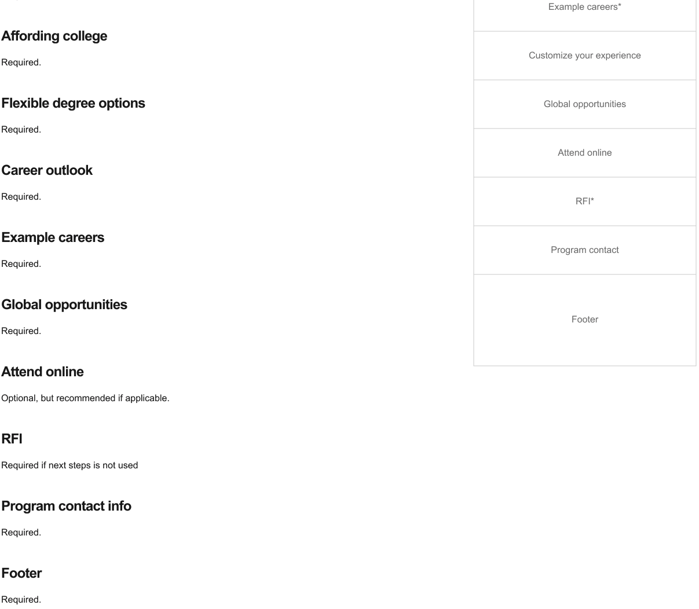

# ASU Degree Pages

ASU Web Standards-based implementation of the Degree page component

## Architecture details

### Document reference

[ux-doc-link]:https://xd.adobe.com/view/03081953-57ea-498f-a7f1-771c92c4dbed-565b/?fullscreen

You can find the UX document [here][ux-doc-link]
### All possible degree page sections


<table>
<tr>
<td>

```HTML
- Global header
- Hero
- Intro content
- Next steps
- Dedicated RFI
- Degree listing
- Areas of study
```
</td>
<td>

```HTML
- Program rankings
- Program facilities
- Location(s)
- Faculty
- Testimonials
- Global opportunities
```

</td>
</tr>

<tr>
<td>

```HTML
- Portfolio/student work
- Alumni/student feature
- Customize your experience
- At a glance
- Application requirements
- Contact information
```

</td>
<td>

```HTML
- Change of major reqs.
- Flexible degree options
- Affording college/Fin aid
- Attend online
- Career outlook
- Example careers
```

</td>
</tr>
</table>


### Degree listing page template
Degree listing pages are used for the actual degree browsing module where users can view a list of filterable degrees in either a table or grid view. Please note that the degree listing module is just one of severa l sections required for this template.

<table style="border:0px;">
  <tr>
    <td style="width:50%; vertical-align: top">
 
    </td>
    <td style="width:50%; vertical-align: top">
 
    </td>
  </tr>
</table>


### Notes:

Units can decide to use or not use the degree listing table column
for college/school. Some colleges may display the different subunits . If they are all the same the college may want to turn this column off.

### Program detail page template

Program detail pages are used for individual degrees or programs. It contains information relevant to each respective degree.This template can be used for all types of program detail pages, whether it's an undergrad degree, grad degree, or certificate/minor. However, each have certain requirements. See the notes section below.

<table style="border:0px;">
  <tr>
    <td style="width:50%; vertical-align: top">
 
    </td>
  </tr>
  <tr>
    <td style="width:50%; vertical-align: top">
 
    </td>
  </tr>
</table>


<span>
  <br/>
</span>

Check out the [UX document][ux-doc-link] for more UI spec details.

## Component views
 The `Degree Component` has 2 types of views:

 - Listing Page view
 - Detail Page view


## DegreePage properties
### ListingPage component

You can find the full list of props types into the file [listing-page-types.js here](/packages/app-degree-pages/src/core/models/listing-page-types.js)

```JS
  /**
  * @typedef {{
  *  actionUrls?: ActionUrlProps
  *  hero?: import("@asu-design-system/components-core/src/components").HeroProps
  *  introContent?: IntroContentProps
  *  hasSearchBar?: boolean
  *  hasFilters?: boolean
  *  programList: GridListProps
  * }} ListingPageProps
  */
```
### ProgramDetailPage component
You can find the full list of props types into the file [program-detail-types.js here](/packages/app-degree-pages/src/core/models/program-detail-typesjs)

```JS
/**
 *  @typedef {{
 *   hide?: boolean
 *  }} HideProp
 *
 *  @typedef {{
 *  dataSource: import("./listing-page-types").ProgramDetailDataSource | string
 *  anchorMenu?: AnchorMenuProps
 *  hero?: HideProp & import("@asu-design-system/components-core/src/components").HeroProps
 *  introContent?: IntroContentProps
 *  programDescription?: ProgramDescriptionProps
 *  requiredCoursesProps?: RequiredCoursesProps
 *  atAGlance?: HideProp & AtAGlanceProps
 *  applicationRequirements?: HideProp
 *  changeMajorRequirements?: HideProp
 *  nextSteps?: HideProp & NextStepsProps
 *  affordingCollege?: HideProp
 *  flexibleDegreeOptions?: HideProp
 *  careerOutlook?: CareerOutlookProps
 *  exampleCareers?: HideProp
 *  globalOpportunity?: HideProp & GlobalOpportunityProps
 *  attendOnline?: HideProp &  AttendOnlineProps
 *  programContactInfo?: {
 *      departmentUrl: string
 *      emailUrl: string
 *  }
 * }} ProgramDetailPageProps
 */
```

## Component props documentation

You can find a full list of props into the [docs/README.props.md](docs/README.props.md)

<a href = "docs/README.props.md">

</a>

## CLI Commands

``` bash
# add app-degree-pages
yarn add @asu-design-system/app-degree-pages

# run storybook
yarn storybook

# build for production with minification
yarn build

# run tests
yarn test

# it generates the document `docs/README.props.md`
yarn docs

# it generates full jsdoc documentation
yarn jsdoc
```
## How to install

1. Make sure you are set up to use the private npm registry at registry.web.asu.edu.
<br/>See instructures in the 'How to use private package registry' here: [README.md](../../README.md)
2. ```yarn add @asu-design-system/app-degree-pages```

## Use as a JS module in React app
### ListingPage component

You can find an extended example of how to set `ListingPage` props [here](/packages/app-degree-pages/src/components/ListingPage/index.stories.js)

```JS
  import { ListingPage } from '@asu-design-system/app-degree-pages'

  const ListingPageApp = ({
    actionUrls,
    hero,
    introContent,
    programList,
    hasFilters,
    hasSearchBar,
  }) => {
  return (
        <ListingPage
          actionUrls={actionUrls}
          hero={hero}
          introContent={introContent}
          programList={programList}
          hasSearchBar={hasSearchBar}
          hasFilters={hasFilters}
      />
    )
  };
```
### ProgramDetailPage component

You can find an extended example of how to set `ProgramDetailPage` props [here](/packages/app-degree-pages/src/components/ProgramDetailPage/index.stories.js)

```JS
 import { ProgramDetailPage } from '@asu-design-system/app-degree-pages'

 const ProgramDetailPageApp = ({
    dataSource,
    anchorMenu,
    introContent,
    hero,
    atAGlance,
    applicationRequirements,
    changeMajorRequirements,
    affordingCollege,
    flexibleDegreeOptions,
    careerOutlook,
    exampleCareers,
    globalOpportunity,
    programContactInfo,
    attendOnline,
    nextSteps,
  }) => (
    <ProgramDetailPage
      dataSource={dataSource}
      anchorMenu={anchorMenu}
      introContent={introContent}
      hero={hero}
      atAGlance={atAGlance}
      applicationRequirements={applicationRequirements}
      changeMajorRequirements={changeMajorRequirements}
      affordingCollege={affordingCollege}
      flexibleDegreeOptions={flexibleDegreeOptions}
      careerOutlook={careerOutlook}
      exampleCareers={exampleCareers}
      globalOpportunity={globalOpportunity}
      programContactInfo={programContactInfo}
      attendOnline={attendOnline}
      nextSteps={nextSteps}
    />
  );
```

## Use on static HTML page

### ListingPage component

You can find an extended example of how to set `ListingPage` props [here](/packages/app-degree-pages/examples/listing-page.html)

```HTML

    <!-- FONTAWESOME loaded from CDN 'kit' URL -->
    <script
      src="https://kit.fontawesome.com/35fb12a3a9.js"
      crossorigin="anonymous"
    ></script>

    <link
      rel="stylesheet"
      href="https://unity.web.asu.edu/bootstrap4-theme/dist/css/bootstrap-asu.css"
    />

    <!-- *************************************************************** -->
    <!-- Load React. -->
    <script
      src="https://unpkg.com/react@17/umd/react.production.min.js"
      crossorigin
    ></script>
    <script
      src="https://unpkg.com/react-dom@17/umd/react-dom.production.min.js"
      crossorigin
    ></script>
    <!-- *************************************************************** -->
    <!-- include bundled scripts from packages -->
    <script src="../dist/vendor.production.js"></script>
    <script src="../dist/degreePages.production.js"></script>

    <div id="degreePageContainer"></div>

    <script>
      AsuDegreePages.initListingPage({
        targetSelector: "#degreePageContainer",
        props: { /** See ee file examples/listing-page.html */ }
      });
    </script>
```
### ProgramDetailPage component

You can find an extended example of how to set `ProgramDetailPage` props [here](/packages/app-degree-pages/examples/program-detail-page.html)

```HTML

    <!-- FONTAWESOME loaded from CDN 'kit' URL -->
    <script
      src="https://kit.fontawesome.com/35fb12a3a9.js"
      crossorigin="anonymous"
    ></script>

    <link
      rel="stylesheet"
      href="https://unity.web.asu.edu/bootstrap4-theme/dist/css/bootstrap-asu.css"
    />

    <!-- *************************************************************** -->
    <!-- Load React. -->
    <script
      src="https://unpkg.com/react@17/umd/react.production.min.js"
      crossorigin
    ></script>
    <script
      src="https://unpkg.com/react-dom@17/umd/react-dom.production.min.js"
      crossorigin
    ></script>
    <!-- *************************************************************** -->
    <!-- include bundled scripts from packages -->
    <script src="../dist/vendor.production.js"></script>
    <script src="../dist/degreePages.production.js"></script>

    <div id="degreePageContainer"></div>

    <script>
      AsuDegreePages.initProgramDetailPage({
        targetSelector: "#degreePageContainer",
        props: { /** See ee file examples/program-detail-page.htmll */ }
      });
    </script>

```
### Examples

The folder [packages/app-degree-pages/examples](/packages/app-degree-pages/examples)
<br/>contains examples to use the component on static HTML page

#### Examples - quick links

- [Listing page](/packages/app-degree-pages/examples/listing-page.html)
- [Program Detail Page](/packages/app-degree-pages/examples/program-detail-page.html)

#### Examples - run and test

If you want to test the examples files you need to install an application server <br />
and run it into the folder `/packages/app-degree-pages/examples`. <br />
For example, if you want to use the `npm` package `lite-server` follow these steps:

- run `npm -g i lite-server`.
<br/>MAC users may need to use `sudo npm -g i lite-server`
- run `cd packages/app-degree-pages`
- run `lite-server`
- open the broweser to the url `http://localhost:3000/examples/degree-page.html`
  <br />(port number may be different)

## Future improvements
All the requirements for version 1 of this component were covered, further enhancements will be implemented in the next version.

# References

- [Font Awesome](https://fontawesome.com/)
    - [CDN link](https://cdnjs.cloudflare.com/ajax/libs/font-awesome/5.13.1/js/all.min.js)
- [ASU bootstrap4-theme](https://unity.web.asu.edu/@asu-design-system/bootstrap4-theme)
    - [CDN link](https://unity.web.asu.edu/bootstrap4-theme/dist/css/bootstrap-asu.css)
- [React](https://reactjs.org/)
- [Add React to a Website](https://reactjs.org/docs/add-react-to-a-website.html)
- [Jest APIs](https://jestjs.io/docs/api)
  - [Jest Fetch Mock](https://www.npmjs.com/package/jest-fetch-mock)
  - [Fix the "not wrapped in act(...)" warning](https://kentcdodds.com/blog/fix-the-not-wrapped-in-act-warning)
  - [Mocking React Components with Jest](https://thoughtbot.com/blog/mocking-react-components-with-jest)
  - [How to Test React Hooks (The Async Ones)](https://medium.com/flatiron-labs/testing-async-react-hooks-6a4d0ce2654c)
  - [Checking children passed to a mock React component](https://prog.world/checking-children-passed-to-a-mock-react-component/)
  - [Mocking `document` in jest](https://newbedev.com/mocking-document-in-jest)
  - [ISSUE with replaceall-is-not-a-function](https://stackoverflow.com/questions/65295584/jest-typeerror-replaceall-is-not-a-function)
  -[Common mistakes with React Testing Library](https://kentcdodds.com/blog/common-mistakes-with-react-testing-library)
- [Type Checking JavaScript Files](https://www.typescriptlang.org/docs/handbook/type-checking-javascript-files.html)
  - [JSDoc Reference](https://www.typescriptlang.org/docs/handbook/jsdoc-supported-types.html)
- [Getting Started with JSDoc 3](https://jsdoc.app/about-getting-started.html)
  - [JSDoc @template: Generics](https://github.com/microsoft/TypeScript/issues/27387)
