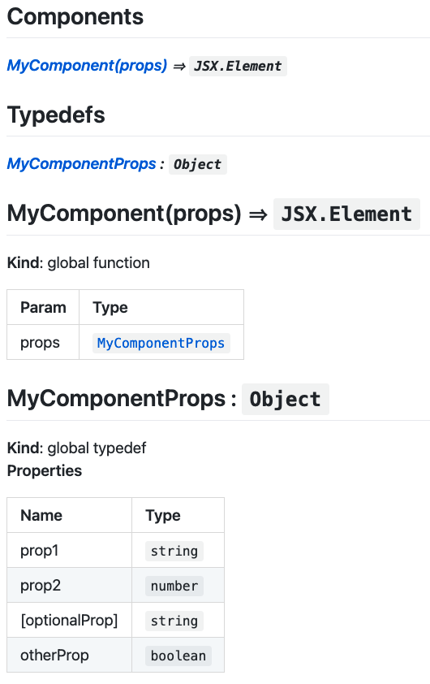

# ASU Carousel
ASU Web Standards-based implementation of `@glidejs/glide` npm library carousel.

## Architecture details

This component is a simple react application showing four different carousels in the `Component views` section.
<br/>The core functionalities, such as transitions, responsiveness, are provided by the library `glidejs`, `BaseCarousel` is the component that implements `glidejs` and can be found in `/src/core/components/BaseCarousel/index.js` and its sub-components in `packages/component-carousel/src/core/components/BaseCarousel/components`.
<br/>The `BaseCarousel` component is used as a blueprint to create any custom carousel.


## Component views
 The new `Carousel Component` has 4 types of views:

 - Card Carousel view
 - Immge Carousel view
 - Image Galllery Carousel view
 - Testomonial Carousel view

## Props and settings
### Card carousel properties

```JS
/**
 * @typedef {{
 *   id: number
 *   imageSource: string
 *   imageAltText: string
 *   title: string
 *   content?: string
 *   eventLocation?: string
 *   buttons?: {
 *    ariaLabel: string,
 *    color?: "gold" | "maroon" | "gray" | "dark"
 *    href?: string,
 *    label: string,
 *    onClick?: () => void,
 *    size: "default" | "small" | "xsmall"
 *   }[]
 *   eventTime?: string
 *   linkLabel?: string
 *   linkUrl?: string
 *   tags?: {
 *      ariaLabel: string,
 *      color: "white" | "gray" | "dark"
 *      href: string,
 *      label: string,
 *      onClick: () => void,
 *   } []
 * }} CardItem
 */

/**
 * @param {{
 *   perView: string | number
 *   cardItems: CardItem []
 *   cardType?: "default" | "degree" | "event" | "news" | "story"
 *   cardEventFormat?: "stack" | "inline"
 *   cardHorizontal?: boolean
 *   maxWidth?: string
 *   width?: string
 *   imageAutoSize?: boolean
 *  }} props
 */
 ```

### Image carousel properties

```JS
/**
 * @typedef {{
 *  id: number
 *  imageSource: string
 *  imageAltText: string
 *  title?: string
 *  content?: string
 * }} ImageItem
 */

/**
 * @param {{
 *    perView: number
 *    imageItems: ImageItem []
 *    maxWidth?: string
 *    width?: string
 *    imageAutoSize?: boolean
 *  }} props
 */
 ```

 ### Image Gallery carousel properties

```JS
/**
 * @typedef {{
 *     id: number,
 *     imageSource: string,
 *     thumbnailSource?: string,
 *     imageAltText:string
 *     content?: any
 * }} ImageCarouselItem
 */

/**
 * @param {{
 *    maxWidth?: string
 *    width?: string
 *    hasContent?: boolean
 *    imageItems: ImageCarouselItem []
 *    imageAutoSize?: boolean
 *  }} props
 */
 ```


 ### Testimonial carousel properties

```JS
  /**
   * @typedef {{
   *      containerCssClass?: string[]
   *      titleCssClass?: string[]
   *      contentCssClass?: string[]
   * }} TestimonialStyle
   */

  /**
   * @typedef {{
   *  id: number
   *  imageSource?: string
   *  imageAltText?:string
   *  quote: {
   *    title?: string
   *    content: string
   *    cite?: {
   *       name: string
   *       description?: string
   *    }
   *  }
   * }} TestimonialItem
   */

  /**
   * @param {{
   *    testimonialItems: TestimonialItem[]
   *    maxWidth: string
   *    width?: string
   *    hasPositionIndicators?: boolean
   *    hasNavButtons?: boolean
   *    itemStyle?:ItemCssClass
   *    imageAutoSize?: boolean
   *  }} props
   */
 ```
## Component props documentation

You can find a full list of props into the [docs/README.props.md](docs/README.props.md)

<table><tr><td>
<a href = "docs/README.props.md">

</a>
</td></tr></table>

## CLI Commands

``` bash
# add component-carousel
yarn add @asu-design-system/component-carousel

# run storybook
yarn storybook

# build for production with minification
yarn build

# run tests
yarn test

# it generates the document `docs/README.props.md`
yarn docs

# it generates full jsdoc documentation
yarn jsdoc

```


## How to install

1. Make sure you are set up to use the private npm registry at registry.web.asu.edu. See instructures in the 'How to use private package registry' here: [README.md](../../README.md)
2. ```yarn add @asu-design-system/component-carousel```


## Use as a JS module in React app

```JAVASCRIPT
    import { AsuCarousel } from '@asu-design-system/component-carousel@dev'

    // Define your carousel items. Contents of "item:" should be a Unity
    // Design System Card. Only one example provided below.
    const myCarouselItems = [
        {
          id: 0,
          imageSource: "https://source.unsplash.com/random/500x400?a=-1",
          imageAltText: "Card image cap",
          title: "Card 1",
          content:
            "Body 1 copy goes here. Limit to 5 lines max. Lorem ipsum dolor sit\n      amet, consectetur adipiscing elit, sed do eiusmod tempor incididunt\n      ut labore et dolore magna aliqua eiusmod tempo.",
          buttons: [
            {
              ariaLabel: "dummy button",
              color: "maroon",
              href: "#",
              label: `Button 1 link here`,
              size: "default",
              onClick: () => window.alert("Holoa Amigo 😃."),
            },
          ],
        },
        {
          id: 1,
          imageSource: "https://source.unsplash.com/random/300x400?a=0",
          imageAltText: "Card image cap",
          title: "Card 2",
          content:
            "Body 2 copy goes here. Limit to 5 lines max. Lorem ipsum dolor sit\n      amet, consectetur adipiscing elit, sed do eiusmod tempor incididunt\n      ut labore et dolore magna aliqua eiusmod tempo.",
          buttons: [
            {
              ariaLabel: "dummy button",
              color: "maroon",
              href: "#",
              label: `Button 2 link here`,
              size: "default",
              onClick: () => window.alert("Holoa Amigo 😃."),
            },
          ],
        },
        {
          id: 2,
          imageSource: "https://source.unsplash.com/random/400x400?a=1",
          imageAltText: "Card image cap",
          title: "Card 3",
          content:
            "Body 3 copy goes here. Limit to 5 lines max. Lorem ipsum dolor sit\n      amet, consectetur adipiscing elit, sed do eiusmod tempor incididunt\n      ut labore et dolore magna aliqua eiusmod tempo.",
          buttons: [
            {
              ariaLabel: "dummy button",
              color: "maroon",
              href: "#",
              label: `Button 3 link here`,
              size: "default",
              onClick: () => window.alert("Holoa Amigo 😃."),
            },
          ],
        },
        {
          id: 3,
          imageSource: "https://source.unsplash.com/random/200x200?a=2",
          imageAltText: "Card image cap",
          title: "Card 4",
          content:
            "Body 4 copy goes here. Limit to 5 lines max. Lorem ipsum dolor sit\n      amet, consectetur adipiscing elit, sed do eiusmod tempor incididunt\n      ut labore et dolore magna aliqua eiusmod tempo.",
          buttons: [
            {
              ariaLabel: "dummy button",
              color: "maroon",
              href: "#",
              label: `Button 4 link here`,
              size: "default",
              onClick: () => window.alert("Hola Amigo 😃."),
            },
          ],
        },
      ];

    // Build out the component, providing your carousel items and setting the
    // perView prop to either 1, 2 or 3 to define number of slides to show at a
    // time.
    const App = (props) => {
      return (
        <div>
          <CardCarousel perView={1} cardItems={myCarouselItems} />
        </div>
      )
    };

    export default App;

```

## Use on static HTML page (illustrating multiple carousels)

```HTML
<!-- Provide target divs for two carousels. Must have unique ids. -->
<div id="carouselContainer"></div>
<div id="anotherCarouselContainer"></div>

<!-- include bundled scripts from Preact packages -->
<script src="/node_modules/@asu-design-system/component-carousel/dist/vendor.production.js"></script>
<script src="/node_modules/@asu-design-system/component-carousel/dist/core.production.js"></script>
<script>
  // Setup and initialize the first carousel.
  var props = {
    targetSelector: "#carouselContainer",
    carouselItems: myCarouselItems, // See myCarouselItems example above.
    perView: 3,
    maxWidth: "100%", // Is not mandatory
  };

  AsuWebCarousel.initCardCarousel(props);

  // Setup and initialize the second carousel.
  AsuWebCarousel.initCardCarousel({
    targetSelector: "#anotherCarouselContainer",
    props: {
      cardItems: differentCarouselItems,// To be built by implementer.
      perView: 1,
      maxWidth: "500px", // Is not mandatory
    },
  });
</script>

```

### Examples

The folder [packages/component-carousel/examples](/packages/component-carousel/examples)
<br/>contains examples to use the carousel on static HTML page

#### Examples - quick links

- [Card carousel](/packages/component-carousel/examples/card.html)
- [Image Gallery carousel](/packages/component-carousel/examples/image-gallery.html)
- [Image carousel](/packages/component-carousel/examples/image.html)
- [Testimonial carousel](/packages/component-carousel/examples/testimonial.html)
#### Examples - run and test

If you want to test the examples files you need to install an application server <br />
and run it into the folder `/packages/component-carousel/examples`. <br />
For example, if you want to use the `npm` package `lite-server` follow these steps:

- run `npm -g i lite-server` . MAC users may need to use `sudo npm -g i lite-server`
- run `cd packages/component-carousel`
- run `lite-server`
- open the broweser to the url `http://localhost:3000/examples/card.html`
  (port number may be different)

# Storybook

 - [Card Carousel](https://unity.web.asu.edu/@asu-design-system/component-carousel/index.html?path=/story/card-carousel--three-item-carousel)
 - [Immge Carousel](https://unity.web.asu.edu/@asu-design-system/component-carousel/index.html?path=/story/image-carousel--image-carousel-default)
 - [Image Galllery Carousel](https://unity.web.asu.edu/@asu-design-system/component-carousel/index.html?path=/story/image-gallery-carousel--image-gallery-carousel-default)
 - [Testomonial Carousel](https://unity.web.asu.edu/@asu-design-system/component-carousel/index.html?path=/story/testimonial-carousel--testimonial-carousel-default)

# UX documents

- [XD Carousel](https://xd.adobe.com/view/56f6cb78-9af5-4b12-b4ce-ef319f71113f-03a5/screen/c4656960-099f-4e74-9f14-7647a5053621/)


## Future improvements
All the requirements for this component were covered, so there is no need of any further enhancements at the moment this is being written.

# References

- [Add React to a Website](https://reactjs.org/docs/add-react-to-a-website.html)
- [GlideJS](https://glidejs.com)
